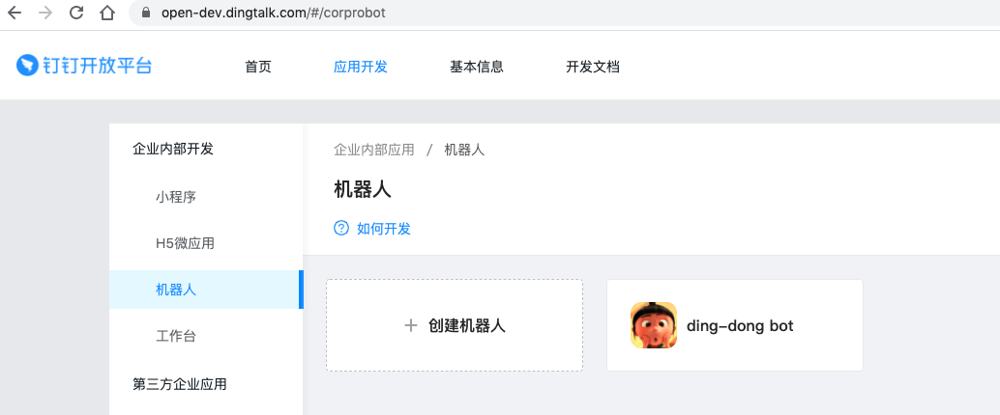
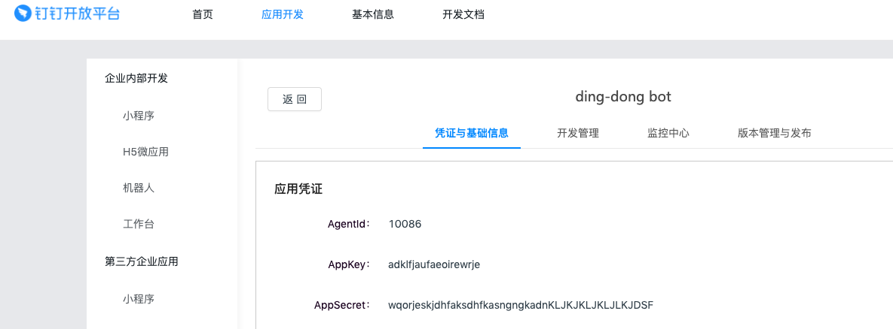
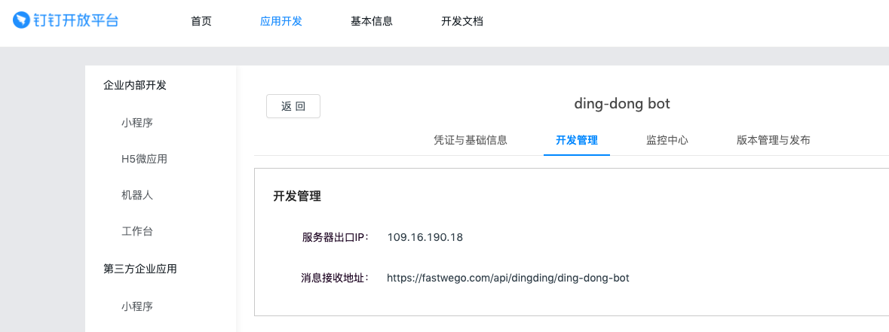
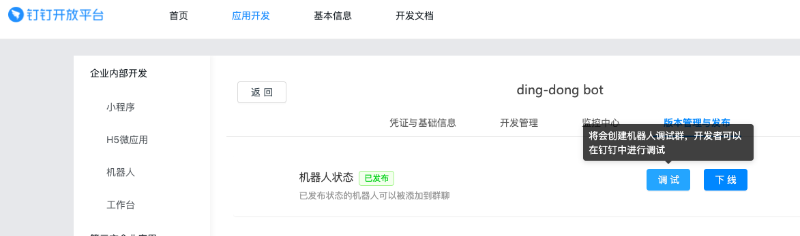
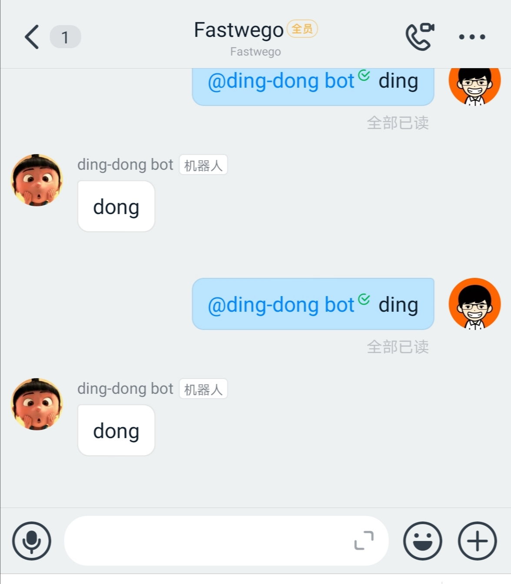

# 如何在钉钉平台上 5 分钟内打造一个叮咚机器人

## 在钉钉注册一个机器人应用

- 配置名称、图标等基本信息


- 获取应用的 appkey/appsecret


- 配置机器人服务器 ip 白名单 和 回调 url


- 发布应用，点击调试后扫码进入钉钉测试群


## 安装 fastwego/dingding 开发 sdk

`go get -u github.com/fastwego/dingding`

## 开发机器人

### 配置

- 将钉钉应用的配置更新到 `.env` 文件：
```.env

AppKey=xxxxxxxxxxx
AppSecret=xxxxxxxxxxxxxxxxxxx

LISTEN=:80
```

- 编写代码：

```go
package main

import (
	"context"
	"encoding/json"
	"log"
	"net/http"
	"os"
	"os/signal"
	"syscall"
	"time"

	"github.com/fastwego/dingding"
	"github.com/spf13/viper"

	"github.com/gin-gonic/gin"
)

var App *dingding.App

func init() {
	// 加载配置文件
	viper.SetConfigFile(".env")
	_ = viper.ReadInConfig()

	// 创建应用实例
	App = dingding.NewApp(dingding.AppConfig{
		AppKey:    viper.GetString("AppKey"),
		AppSecret: viper.GetString("AppSecret"),
	})

}

func main() {

	router := gin.New()
	router.Use(gin.Logger(), gin.Recovery())

	// 接收 钉钉 回调
	router.POST("/api/dingding/ding-dong-bot", DingDongBot)

	svr := &http.Server{
		Addr:    viper.GetString("LISTEN"),
		Handler: router,
	}

	go func() {
		err := svr.ListenAndServe()
		if err != nil && err != http.ErrServerClosed {
			log.Fatalln(err)
		}
	}()

	quit := make(chan os.Signal)
	signal.Notify(quit, syscall.SIGINT, syscall.SIGTERM)
	<-quit

	timeout := time.Duration(5) * time.Second
	ctx, cancel := context.WithTimeout(context.Background(), timeout)
	defer cancel()

	if err := svr.Shutdown(ctx); err != nil {
		log.Fatalln(err)
	}
}

// 机器人响应
func DingDongBot(c *gin.Context) {

	// 回复 一条消息
	reply := struct {
		Msgtype string `json:"msgtype"`
		Text    struct {
			Content string `json:"content"`
		} `json:"text"`
	}{}
	reply.Msgtype = "text"
	reply.Text.Content = "dong"

	data, err := json.Marshal(reply)
	if err != nil {
		return
	}

	c.Writer.Write(data)
}

```

## 编译 & 部署 到服务器

`GOOS=linux go build`

`chmod +x ./ding-dong-bot && ./ding-dong-bot`

## 测试群里发送消息

 将机器人加入到企业内部群里，@ding-dong-bot 发送 `ding` ，机器人就会回复 `dong`



## 结语

恭喜你！5分钟内就完成了一款钉钉机器人开发

完整演示代码：[https://github.com/fastwego/dingding-demo](https://github.com/fastwego/dingding-demo)